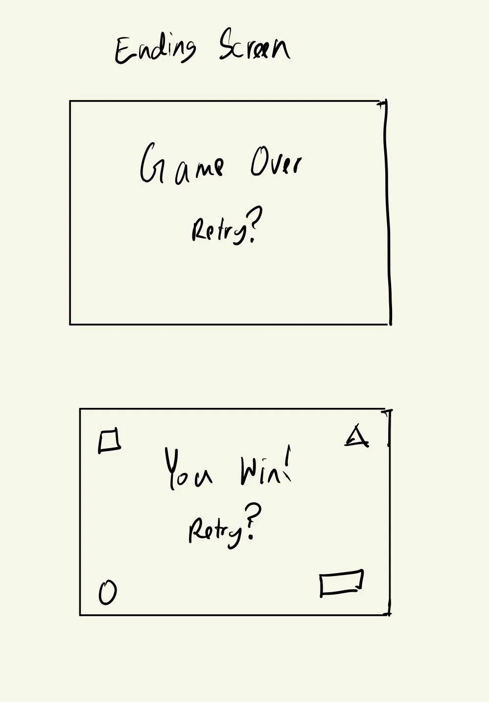

# Polyscend
Creative Embedded Systems Module 2 (and potentially forward) Project: Uses the TFT_eSPI library, Arduino Breadboard, Joystick, Potentiometer, Push Button, and Processing IDE to play a roguelike Polygon game.

## Demo
[](https://www.youtube.com/watch?v=3jatGV5Dqco)


## Blog Post

You can take an in depth look at my process making this program in this [blog post](https://chambray-dragon-de5.notion.site/Polyscend-WIP-133c917d299b80688067e0796abdf969).

## Table of Contents

- [Features and Tools](#features-and-tools)
- [How to Build the Project](#how-to-build-the-project)
- [Circuit Design](#circuit-design)
- [Concept Design](#concept-design)
- [Enclosure Design](#enclosure-design)
- [Contributors](#contributors)

## Features and Tools

- [Arduino IDE](https://support.arduino.cc/hc/en-us/articles/360019833020-Download-and-install-Arduino-IDE)
- [Processing IDE](https://processing.org/download)
- [Lilygo TTGO ESP32](https://www.amazon.com/LILYGO-T-Display-Arduino-Development-CH9102F/dp/B099MPFJ9M?th=1)
- [Arduino Breadboard](https://www.adafruit.com/product/64?gad_source=1&gclid=Cj0KCQjwm5e5BhCWARIsANwm06jBkppfOYt0X_Ko7d-rAXHAg3aQEKUqj_uoRFi0dKfiDsCz8POLOksaAoIcEALw_wcB)
- [Joystick](https://www.aliexpress.us/item/3256806002431759.html?spm=a2g0o.productlist.main.9.27cc669cp7PAyl&algo_pvid=5b7c1c10-8ecc-4a5a-93ae-169c947d8ba0&algo_exp_id=5b7c1c10-8ecc-4a5a-93ae-169c947d8ba0-4&pdp_npi=4%40dis%21USD%211.08%210.99%21%21%211.08%210.99%21%40210321dc17219345348044203eb837%2112000036194260765%21sea%21US%210%21ABX&curPageLogUid=DToZBiVTSLtx&utparam-url=scene%3Asearch%7Cquery_from%3A)
- [Potentiometer](https://www.digikey.com/en/products/detail/sparkfun-electronics/COM-09806/7319606?s=N4IgTCBcDaIMIHkCyBaADATgBxoGwgF0BfIA)
- [Tactile Push Button Switch](https://www.aliexpress.us/item/3256806107122384.html?spm=a2g0o.order_list.order_list_main.47.21ef1802q6HtRj&gatewayAdapt=glo2usa#nav-specification)
- USB-C cable

## How to Build the Project 

1. Clone the repository:

   ```bash
   git clone https://github.com/asder8215/Polyscend.git
   ```
2. From the src folder, import or move the `input_setup.ino` file in `src/arduino_setup` folder into Arduino Folder
    * If Arduino IDE is not installed, look at this [Arduino Support Page](https://support.arduino.cc/hc/en-us/articles/360019833020-Download-and-install-Arduino-IDE) on how to install the Arduino IDE.

3. Follow these [installation steps](https://coms3930.notion.site/Lab-1-TFT-Display-a53b9c10137a4d95b22d301ec6009a94) to correctly set up the libraries needed to write and run code for TTGO ESP32

4. Once your Arduino IDE is set up, you can connect your ESP32 to your laptop or computer via USB-C and click on the `Upload` button on the top left of the Arduino IDE. This will make the code compile and store onto the ESP32.

5. Set up the circuitry with the ESP32, joystick, potentiometer, push button on the breadboard following the Fritzing diagram below (Note: any modifications done to the circuitry on the breadboard should be done while the ESP32 is unplugged from your laptop).

6. After your circuitry is fully set up, you can plug your ESP32 to your laptop and see on Serial Monitor (make sure the baud rate is set at 9600) if output is printing on there based on your joystick's position, potentiometer value, and button state (whether it's pressed or not). 

7. To further check if it works, you can open up Processing IDE (ESP32 must remain connected to your laptop via USB-C) and open the file `input_test.pde` in `src/input_test` folder. You can then run the program on Processing and see if Processing is able to receive your input. The program should show a circle on screen, which can be moved by the joystick, turn white when the push button is clicked, and its radius should vary based on the clockwise position of the potentiometer knob.

8. If all of that works perfectly, you can open and run the `polyscend.pde` file (make sure `Entity.pde` and `data/pixel_operator` folder is in the same directory as it) in `src/polyscend` folder. See how the demo above on how it works!

9. Optional: You can 3D print cases for your joystick, potentiometer, and push button to have a more comfortable time playing the game with it.

## Circuit Design


- Note: You can directly insert the potentiometer and push button to the arduino breadboard or solder the ends of the potentiometer/push button to the breadboard. You can solder for the joystick's ends or use header wires to connect it to the board as well.

## Concept Design

These contain images of Polyscend concept design. Some of these images may not be implemented or changed on how it works/shown in the game as it is currently.

- Title Screen

- Battle System

- Reward Screen (Not implemented)

- Ending Screens (Win screen not implemented)


## Enclosure Design

These contains images of the enclosure made for the joystick, potentiometer, and push button. 

- Design in drawing

- Actual enclosure


- Note: You can find the stl files used to 3D this enclosure for the joystick, potentiometer, and push button in `enclosure_design` folder. A lot of tapes was used to keep the individual cases for joystick, button, and potentiometer together.

## Contributors

- Mahdi Ali-Raihan